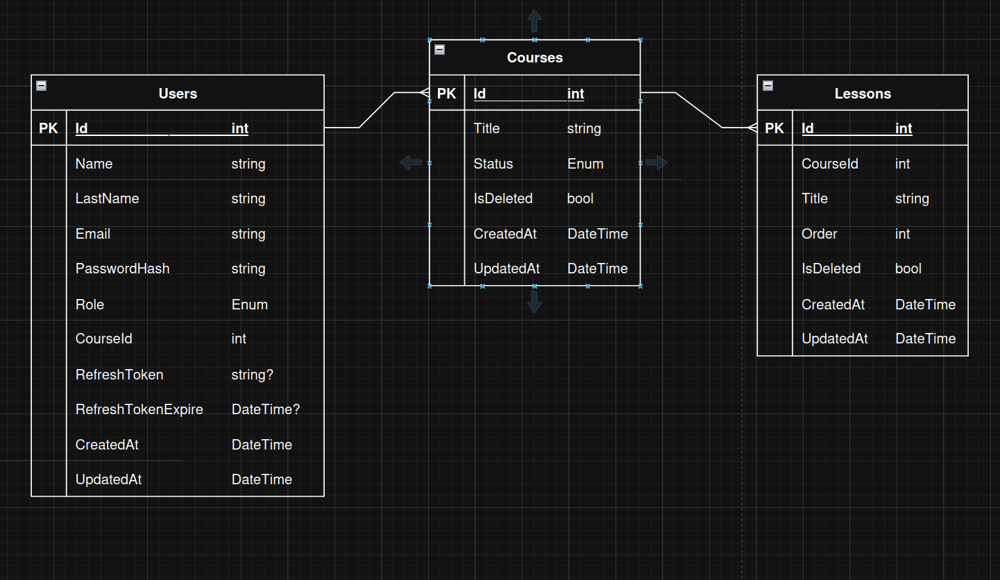

# README
- Presented by: Diego Vallejo Zapata
- Doc: 1085310892
- Clan: Hopper | Riwi

User Admin: carlos@gmail.com
password: 123456789

## Project
This project was developed for a management of online courses. It has has Clean Architecture with DDD in C# .NET.

The Excel file is the main source of your model. Based on it, you must define your entities, relationships, and internal structure.
## Instructions
How to clone the project:
For cloning this project you must:

1) Copying the link of this repo on GitHub.
2) Open your Terminal or Console (Windows / Linux) in the desire location.
3) Writing on the console "git clone + repo'sUrl" => enter
4) Entering to the folder's project writing its name on the terminal.
5) Executing the project with "rider ." (if you are using Rider) or "code ." (if you prefer using VSCode).
   You are ready to watch the entire project on an IDE.

Last but not least, you can execute the project with dotnet run --project -p cursos.Api/

## Installing:
Is not mandatory, but it's better to install the next nuggets:

### Project 'cursos.Api' has the following package references
```
> AutoMapper                                               12.0.1 
> AutoMapper.Extensions.Microsoft.DependencyInjection      12.0.1
> Microsoft.AspNetCore.Authentication.JwtBearer            9.0.0 
> Microsoft.EntityFrameworkCore.Design                     9.0.0    
> Swashbuckle.AspNetCore                                   9.0.0   
> Swashbuckle.AspNetCore.SwaggerGen                        9.0.0  
> Swashbuckle.AspNetCore.SwaggerUI                         9.0.0
```

### Project 'cursos.Application' has the following package references
```
> AutoMapper                                               12.0.1 
> AutoMapper.Extensions.Microsoft.DependencyInjection      12.0.1 
> BCrypt.Net-Next                                          4.0.3 
> Microsoft.Extensions.Configuration                       10.0.0 
> Microsoft.Extensions.Configuration.Abstractions          10.0.0  
> System.IdentityModel.Tokens.Jwt                          8.15.0   

```
### Project 'cursos.Domain' has the following package references
```
> Microsoft.EntityFrameworkCore             9.0.0  
> Microsoft.EntityFrameworkCore.Design      9.0.0   
> Pomelo.EntityFrameworkCore.MySql          9.0.0   
```

By terminal, you need to do the next steps:
```
# Install dotnet EF (if you don't have installed EF): 
dotnet tool install --global dotnet-ef 

# Command to do a migration:
dotnet ef migrations add InitialCreate --project cursos.Infrastructure/ --startup-project cursos.Api/

# Comand to create or update the DB according with the migration:
dotnet ef database update --project cursos.Infrastructure/ --startup-project cursos.Api/
```

### Special notes:

- Before you start the migration, it is mandatory that you change the password and user in "DefaultConnection" (appsettings.json) with your own credentials of MySql or change/add the appsettings.json inside projCSharp.Api.
- This project is not a minimal Api, forthermore, we it's mandatory to remove openApi from nugets packages, instead of that, we are using: Swashbuckle.AspNetCore
- The secury aspect is managed with JWT (Jason Web Token) according roles.
- There is a folder named "Documentation", inside you will find UML and Use Cases Diagrams, additionally, inside are the screenshoots which are the evidence of the correct use of the application.


## Architecture
This project was developed with a layered architecture DDD (Domain Driven Design).
This architectures is very used currently due to manage responsabilities in better way because each layer (project) contains specific logic:
- Domain: Contains Entities, Enums, Interfaces for Repositories.
- Infrastructure: Contains all related with database, for instance Data (AppDbContext), Migrations and Repositories.
- Application: Contanins business logic such as DTO's, Services Interfaces and Services.
- Api: Contains Controllers and the Program file (the orchester).





